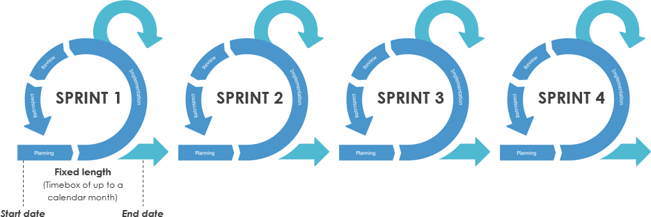
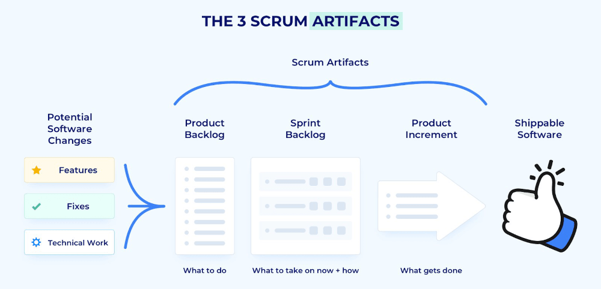
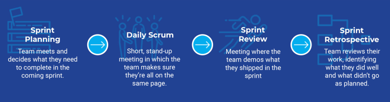
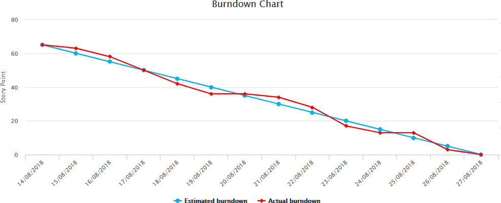

# Agile Methodologies Interview Questions

Q. What is Agile?

Answer

Agile is an approach or mindset in project management and software development. It emphasizes on building software incrementally while adapting and responding to changes as the product and requirements evolve. Agile was introduced as a flexible methodology in response to the rigidness of the traditional waterfall methodology.

---

Q. How does Agile differ from the traditional Waterfall methodology?

Answer

- Agile values adaptability and involvement; Waterfall values planning ahead.
- Agile is an incremental and iterative approach; Waterfall is a linear and sequential approach.
- Agile separates a project into sprints; Waterfall divides a project into phases.
- Agile helps complete many small projects; Waterfall helps complete one single project.
- Agile introduces a product mindset with a focus on customer satisfaction; Waterfall introduces a project mindset with a focus on successful project delivery.
- Requirements are prepared everyday in Agile, while requirements are prepared once at the start in Waterfall.
- Agile allows requirement changes at any time; Waterfall avoids scope changes once the project starts.
- Testing is performed concurrently with development in Agile; testing phase comes only after the build phase in Waterfall.
- Test teams in Agile can take part in requirements change; test teams in Waterfall do not get involved in requirements change
- Agile enables the entire team to manage the project without a dedicated project manager; Waterfall requires a project manager who plays an essential role in every phase.

---

Q. What are some potential drawbacks of using an Agile methodology?

Answer

- Agile is simple to understand in principle but hard to do well in practice. It requires real commitment and first attempts are not likely to go very well.
- The fact that Agile requires minimal planning at the beginning makes it easy to get sidetracked delivering new, unexpected functionality.
- Agile demands more time and energy from everyone because developers and users (e.g. Product Owner) must constantly interact with each other.
- There can be less of a blueprint of what the final deliverable will be. This can make it harder to gain commitment to the project by stakeholders at the early stage.
- Agile can be challenging when there is a supplier-customer relationship. Customers typically want to know what they are getting for their money as early as possible.
- Agile can be very challenging on much larger projects or where co-location is not possible (between developers and the business).
- The agile approach often requires quick shifts from one aspect of a project to another. This may leave little time for doing the proper paperwork at each stage. Record-keeping is important, but it is often a casualty of agile working methods.
- Features that are too big to fit into one or even several cycles might be avoided because they don't fit in nicely into the philosophy.

---

Q. What is Scrum?

Answer

Scrum is an agile framework for developing, delivering, and sustaining software products and services, although since its inception it has gained popularity in other fields as well such as research, sales, marketing and advanced technologies.

The Scrum framework is designed for teams of ten or fewer members, who break their work into goals that can be completed within time-boxed iterations, called sprints, no longer than one month and most commonly two weeks. The Scrum Team track progress in 15-minute time-boxed daily meetings, called daily scrums. At the end of the sprint, the team holds sprint review, to demonstrate the work done, and sprint retrospective to improve continuously.

---

Q. Are Agile and Scrum the same thing?

Answer

No. Agile is a philosophy or mindset and a set of principles. It is an umbrella term used for a number of specific methodologies, one of which is Scrum. While Scrum is the most popular way to implement the agile framework, there are other popular agile methodologies out there such as Kanban and Extreme Programming (XP).

---

Q. What is a Scrum Sprint?

Answer

A Scrum Sprint is a recurring time-box of one month or less during which a "Done", useable, and potentially releasable product Increment is created.

---

Q. What are the three Scrum artifacts?

Answer

1. **Product Backlog**  
The Product Backlog is an ordered list of everything that is known to be needed in a product. It is constantly evolving and is never complete.

2. **Sprint Backlog**  
The Sprint Backlog is a list of everything that the team commits to achieve in a given Sprint. Once created, no one can add to the Sprint Backlog except the Development Team. If the Development Team needs to drop an item from the Sprint Backlog, they must negotiate it with the Product Owner. During this negotiation, the ScrumMaster should work with the Development Team and Product Owner to try to find ways to create some smaller increment of an item rather than drop it altogether.

3. **Product Increment**  
At the end of every Sprint, the team must complete a product increment that is potentially releasable, meaning that meets their agreed-upon definition of done.

---

Q. What are the four Scrum events or ceremonies?

Answer

1. **Sprint Planning**  
During Sprint Planning, the entire Scrum Team collaborates and discusses the desired high-priority work for the Sprint and defines the Sprint Goal. The ScrumMaster's role is primarily to facilitate the meeting. The Product Owner describes the objective of the Sprint and also answers questions from the Development Team about execution and acceptance criteria / criteria of satisfaction. The development team has the final say in how much of the high-priority work it can accomplish during the Sprint.

2. **Daily Scrum**  
The Development Team meets for 15 minutes (or less) every day of the Sprint to inspect progress toward the Sprint Goal. They describe for each other how their own work is going, ask for help when needed, and consider whether they are still on track to meet the Sprint Goal. This is not a status meeting but is instead an opportunity for the Development Team to inspect and adapt the product and process on a daily basis.

3. **Sprint Review**  
Sprint reviews focus on the product being developed, specifically on the potentially shippable product increment created during the sprint. During a sprint review, the Scrum Team invites stakeholders to discuss what was completed during the Sprint. They adapt the Product Backlog as needed based on this feedback. The Product Owner has the option to release any of the completed functionality. Though a demo might be part of this meeting, the primary purpose of the Sprint Review is the inspect and adapt capability provided by the discussion.

4. **Sprint Retrospective**  
Sprint retrospectives focus on the process. During a sprint retrospective the Scrum Team discusses what went right and areas for improvement in the Sprint. They make tangible plans for how to improve their own process, tools and relationships.

---

Q. What is the role of the scrum master in a scrum team?

Answer

The Scrum Master is accountable for a scrum Team's effectiveness. They focus on coaching the team members in self-management and cross-functionality, eliminating impediments to the team's progress and shielding them from outside interference, and making sure that all scrum events and ceremonies take place and are positive, productive, and kept within the alloted time.

In addition to working with team members, scrum masters also work with project owners as well as stakeholders to ensure that everyone understands and follows scrum practices and is clear about what the team is working on and what the objectives are.

---

Q. What Is a Sprint Burndown Chart?

Answer

Sprint burndowns are a graphical way of showing how much work is remaining in the sprint, typically in terms of task hours. It is typically updated at the daily scrum. As the sprint progresses, the amount of work remaining should steadily decrease and should trend toward being complete on the last day of the sprint. Burndowns that show increasing work or few completed tasks are signals to the Scrum Master and the team that the sprint is not going well. Sprint burndown charts helps teams gauge whether they will complete the work of a sprint. Burndown charts also reinforce the Scrum values of commitment, focus and openness and one of the three pillars of empirical process control: transparency.

---
