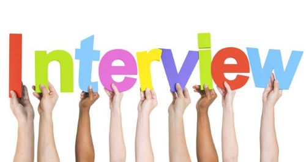

# Common Non-technical Interview Questions

Q. Tell me about yourself?

Answer

This is usually considered an icebreaker question asked at the very beginning of an interview.

Keep your answer short and related to the position you are applying for. Remember that the interviewer is not your friend or therapist... yet.

Assume that the interviewer(s) have not looked at your resume or do not have it in front of them, so feel free to highlight any notable achievements or experiences or things that you are particularly proud of.

---

Q. Do you have any questions for us?

Answer

This question is usually asked at the end of the interview. This is your opportunity to further show the interviewers your eagerness and passion for becoming part of the organization.

Avoid asking questions that have been already discussed or alluded to during the interview. Also consider the interviewer's role within the company. A person from HR may not be familiar with the tech stack used at the company or the VP of Engineering may not know the exact roles and responsibilities within your team. Lastly, it is advisable to avoid asking questions about pay, benefits, hours of work, break times, etc. These topics are usually more appropriate during the contract negotiation once the organization has expressed interest in offering you the role.

Some good questions to consider:
- What's your favorite thing about working here?
- How many other people are in my team? Any other juniors?
- What types of skills is the team missing that you're looking to fill with a new hire?
- What is the top priority for someone in this role?
- If I were hired for this role, what would you want me to achieve in my first couple of months?
- What are the biggest challenges that someone in this position would face at the beginning?
- Do you expect to hire more people in my team in the near future?

---

Q. Tell us about a time you had a conflict with a coworker or manager and how you dealt with it.

Answer

For behavioral questions such as this, the interviewer is looking for a specific situation that you can recall, and how you resolved the conflict or issue or what you learned from it.

---

Q. If we called your previous employer/coworkers, what would they say about you?

Answer

Think of specific examples that can back up your claims. For example, instead of saying "they would say that I have great attention to details", think of a specific situation or example where you displayed this quality in action.

---

Q. Where do you see yourself five years from now?

Answer

Check your ego when answering this question. There is a difference between eagerness and arrogance.

---

Q. What is your greatest strength?

Answer

Again, rather than listing your strengths, can you come up with any actual examples from your past experiences where you showcased those strengths?

---

Q. What is your greatest weakness?

Answer

Preferably stay away from cliche answers (e.g. I am a perfectionist) or things that are not really a weakness and have nothing to do with the role (e.g. I am not very good at ice skating).

---

Q. Why did you leave your last position?

Answer

It is advisable to not talk negatively about your previous organization, role, or coworkers. Every end is a new beginning, so focus on the things you are trying to achieve by taking on a new role at a new organization.

---

Q. Why did you decide to use this stack or technology in this particular project?

Answer

Be ready to speak about your personal projects in detail and to touch on your decision-making process.

---

Q. How do you stay up-to-date with the latest industry trends and technology news?

Answer

- YouTube (feel free to name any well-known channels that you follow)
- Online courses (Udemy, LinkedIn Learning, etc.)
- Podcasts (name any you listen to)
- Newsletters (name any you are subscribed to)
- Reddit (name any subreddits you follow: r/webdev, etc.)
- Hacker News, etc.
- Tech influencers on Twitter & LinkedIn

---

Q. What book are you currently reading (or What's your favorite book)?

---
