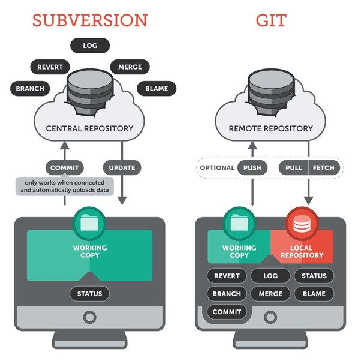

<h1>Git</h1>

<ol>

<li>How does Git differ from SVN?</li>

Answer

Subversion(SVN) is a centralized version control system. This means that the remote repository is the only true central place of storage and exchange. The project's commit history is saved there - and only there! In cases when this central remote repository is not available (offline or broken), people will not be able to work.

Git is a distributed version control system. This means that every developer / collaborator has a full-blown version of the project on their machine, including all commit history. With a decentralized VCS, you can work offline and make commits to your own local repository - and then decide when you want to share and upload your work to a shared remote repository.

<li>Are Git and GitHub the same thing?</li>

Answer

Not quite. Git is installed locally, whereas GitHub is a web-based hosting service for git repositories. GitHub also offers additional features such as issue tracking, user management, and hosting web pages.

</ol>
