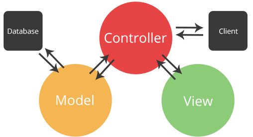
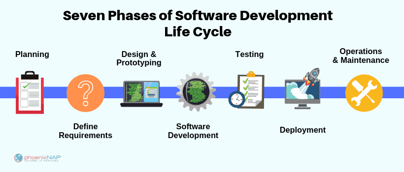
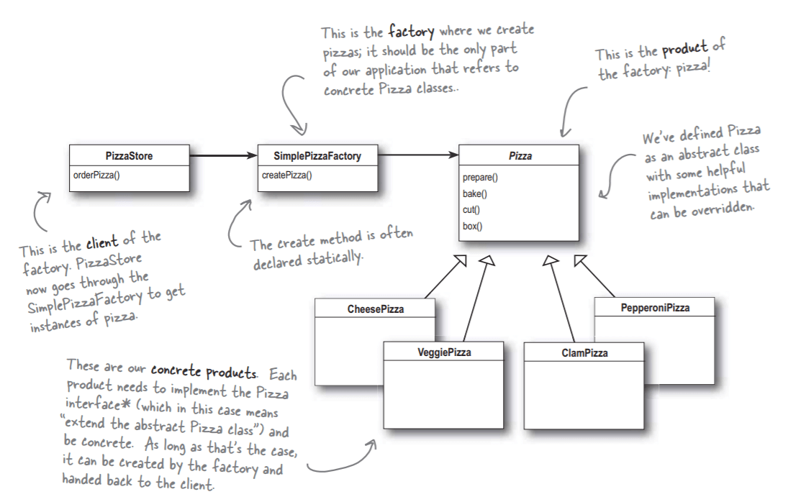

# Web Development Interview Questions

Q. What is an API?

<details><summary>Answer</summary>

An application programming interface (API) is a set of clearly defined methods of communication among various components.

An API simplifies programming by abstracting the underlying implementation and only exposing objects or actions the developer needs.


</details>

---

Q. What is REST?

<details><summary>Answer</summary>

REST is acronym for REpresentational State Transfer. It is an architectural style that developers follow when they create their RESTful APIs.

In order to be a true RESTful API, a web service must adhere to the six REST architectural constraints (see below).

</details>

---

Q. What does it mean for an API to be RESTful?

<details><summary>Answer</summary>

In order to be a true RESTful API, a web service must adhere to the following six REST architectural constraints:

1. **Client-Server based**:  
The client and the server should be separate from each other and allowed to evolve individually and independently.

2. **Use of a uniform interface (UI)**:  
The key to the decoupling client from server is having a uniform interface that allows independent evolution of the application without having the application’s services, models, or actions tightly coupled to the API layer itself. The uniform interface lets the client talk to the server in a single language, independent of the architectural backend of either.

3. **Stateless operations**:  
Meaning that requests can be made independently of one another, and each request contains all of the data necessary to complete itself successfully. A REST API should not rely on data being stored on the server or sessions to determine what to do with a request, but rather solely rely on the data that is provided in that request itself. Identifying information is not being stored on the server when making requests. Instead, each request has the necessary data in itself, such as the API key, access token, user ID, etc.

4. **Caching**:  
A REST API should be designed to encourage the storage of cacheable data on the client side in order to reduce the number of interactions with the API. This means that when data is cacheable, the response should indicate that the data can be stored up to a certain time (expires-at), or in cases where data needs to be real-time, that the response should not be cached by the client.

5. **Layered system**:  
REST allows for an architecture composed of multiple layers of servers. The requesting client need not know whether it’s communicating with the actual server, a proxy, or any other intermediary.

6. **Code on demand (optional)**:  
Most of the time, a server will send back static representations of resources in the form of XML or JSON. However, when necessary, servers can send executable code to the client.

</details>

---

Q. RESTful APIs are stateless. What does this mean?

<details><summary>Answer</summary>

It means that API requests can be made independently of one another, and each request contains all of the data necessary to complete itself successfully.

A REST API should not rely on data being stored on the server or sessions to determine what to do with a request, but rather solely rely on the data that is provided in that request itself.

Identifying information is not being stored on the server when making requests. Instead, each request has the necessary data in itself, such as the API key, access token, user ID, etc.

</details>

---

Q. What are the four parts of a RESTful web service request?

<details><summary>Answer</summary>

1. Endpoint URL:  
The root-endpoint is the starting point of the API you're requesting from. The root-endpoint of GitHub's API is `https://api.github.com` while the root-endpoint Twitter's API is `https://api.twitter.com`.

2. The HTTP method:  
The method is the type of request you send to the server. You can choose from these five types: GET, POST, PUT, PATCH, and DELETE. These are used to perform create, read, update, and delete (CRUD) operations.

3. HTTP headers:  
Information such as authentication tokens or cookies can be contained in the HTTP request header. HTTP Headers are key-value pairs. E.g. `Content-Type: application/json`

4. Body Data:  
The data (sometimes called "body" or "message") contains information you want to be sent to the server. Data is normally transmitted in the HTTP body in an identical way to HTML `<form>` submissions or by sending a single JSON-encoded data string.

</details>

---

Q. How does REST differ from SOAP?

<details><summary>Answer</summary>

SOAP is a standardized protocol that sends messages using other protocols such as HTTP and SMTP. The SOAP specifications are official web standards, maintained and developed by the World Wide Web Consortium (W3C). As opposed to SOAP, REST is not a protocol but an architectural style. The REST architecture lays down a set of guidelines you need to follow if you want to provide a RESTful web service, for example, stateless existence and the use of HTTP status codes.

As SOAP is an official protocol, it comes with strict rules and advanced security features such as built-in ACID compliance and authorization. Higher complexity, it requires more bandwidth and resources which can lead to slower page load times.

REST was created to address the problems of SOAP. Therefore it has a more flexible architecture. It consists of only loose guidelines and lets developers implement the recommendations in their own way. It allows different messaging formats, such as HTML, JSON, XML, and plain text, while SOAP only allows XML. REST is also a more lightweight architecture, so RESTful web services have a better performance. Because of that, it has become incredibly popular in the mobile era where even a few seconds matter a lot (both in page load time and revenue).

</details>

---

Q. What is AJAX?

<details><summary>Answer</summary>

Asynchronous JavaScript and XML (AJAX or Ajax) is a set of web development techniques using many web technologies on the client-side to create asynchronous web applications.

With Ajax, web applications can send and retrieve data from a server asynchronously (in the background) without interfering with the display and behavior of the existing page.

</details>

---

Q. Can you describe CORS?

<details><summary>Answer</summary>

Cross-Origin Resource Sharing (CORS) is a security mechanism that prevents a malicious site from reading or modifying another site's data.

A request for a resource (like an image or a font) outside of the origin is known as a cross-origin request. CORS manages cross-origin requests. With CORS, a server can specify who can access its assets and which HTTP request methods are allowed from external resources.

CORS relies on a mechanism by which browsers make a "preflight" request to the server hosting the cross-origin resource, in order to check that the server will permit the actual request. In that preflight, the browser sends headers that indicate the HTTP method and headers that will be used in the actual request.

</details>

---

Q. What is JSONP?

<details><summary>Answer</summary>

JSONP (JSON with Padding) is a simple way to overcome browser restrictions when sending JSON responses from different domains from the client.

JSONP wraps up a JSON response into a JavaScript function and sends that back as a script to the browser. A script is not subject to the Same Origin Policy and when loaded into the client, the function acts just like the JSON object that it contains.

```js
// an example of JSON
 {"weapon":"nunchucks","headband":"yellow"}

 // an example of JSONP
 myCallback({"weapon":"nunchucks","headband":"yellow"});
 ```

</details>

---

Q. What is a MVC?

<details><summary>Answer</summary>

Model-View-Controller or MVC is a design pattern used to separate user-interface (view), data (model), and application logic (controller). Controller acts as a liaison between the Model and the View, receiving user input and deciding what to do with it.



</details>

---

Q. What is the Software Development Life Cycle (SDLC)?

<details><summary>Answer</summary>

In software engineering, the SDLC is a process for planning, creating, testing, and deploying an information system.



</details>

---

Q. What is Object-oriented programming (OOP)?

<details><summary>Answer</summary>

Object-oriented programming (OOP) is a programming paradigm that relies on the concept of classes and objects. A class is a template (blueprint) for objects, and an object is an instance of a class.


</details>

---

Q. Are you familiar with the four pillars of object-oriented programming?

<details><summary>Answer</summary>

The four principles (pillars) of object-oriented programming are abstraction, encapsulation, inheritance, and polymorphism.

**Abstraction**: hiding the inner workings of a class and just allowing the necessary portions be visible.

**Encapsulation**: a process of binding data members (variables, properties) and member functions (methods) together. In object oriented programming language we achieve encapsulation through Class.

**Inheritance**: the process of creating the new class by extending the the existing class

**Polymorphism**: functions with same name but different arguments, which will perform differently. That is function with same name, functioning in different way. Or, it also allows us to redefine a function to provide its new definition.

</details>

---

Q. Have you heard of the SOLID principles in object-oriented programming?

<details><summary>Answer</summary>

In object-oriented programming, SOLID is a mnemonic acronym for five design principles intended to make software designs more understandable, flexible, and maintainable.

**Single-responsibility principle**: Every module, class or function should only have a single responsibility.

**Open–closed principle**: Software entities (classes, modules, functions, etc.) should be open for extension, but closed for modification; that is, we should be able to add new functionality without touching the existing code for the class. This is because whenever we modify the existing code, we are taking the risk of creating potential bugs. So we should avoid touching the tested and reliable (mostly) production code if possible.

**Liskov substitution principle**: Given that class B is a subclass of class A, we should be able to pass an object of class B to any method that expects an object of class A and the method should not give any weird output in that case. This is the expected behavior, because when we use inheritance we assume that the child class inherits everything that the superclass has. The child class extends the behavior but never narrows it down.

**Interface segregation principle**: The principle states that many client-specific interfaces are better than one general-purpose interface. Clients should not be forced to implement a function they do no need. For example an interface for an ATM which handles all requests such as a deposit request or a withdrawal request, needs to be segregated into individual and more specific interfaces.

**Dependency inversion principle**: It states that our classes should depend upon interfaces or abstract classes instead of concrete classes and functions.

</details>

---

Q. How does Continuous Integration (CI) differ from Continuous Delivery (CD)?

<details><summary>Answer</summary>

**Continuous Integration** is merging all code from all developers to one central branch of the repo many times a day trying to avoid conflicts in the code in the future.

**Continuous Deployment** ensures that every change that is made is ready to be deployed to production.

CI helps development teams avoid "integration hell" where the software works on individual developers' machines, but it fails when all developers combine (or "integrate") their code. Continuous Delivery goes one step further to automate a software release, which typically involves packaging the software for deployment in a production-like environment. The goal of Continuous Delivery is to make sure the software is always ready to go to production, even if the team decides not to do it for business reasons.

</details>

---

Q. What is A/B testing?

<details><summary>Answer</summary>

A/B testing (also known as split testing) is a process of showing two variants of the same web page or app to different segments of visitors or users at the same time and comparing which variant drives more conversions.

</details>

---

Q. What would cause a 403 error in the browser?

<details><summary>Answer</summary>

A 403 Forbidden Error occurs when a web server forbids the user from accessing the page they are trying to open in their browser. Sometimes the user really does not have the right permission to access the resource, other times, there might be an error on the server side of things.

</details>

---

Q. What are some things you can do to improve the performance of your webpage?

<details><summary>Answer</summary>

- Reducing or delaying HTTP calls
- Minifying files
- Loading CSS & JS resources asynchronously
- Making use of a Content Delivery Network (CDN)
- Compressing images
- Making use of browser caching
- Prioritizing above-the-fold content (lazy loading)
- Minimizing redirects as well as 404s

</details>

---

Q. What are some of the things you can do to ensure that your front-end code will work on different browsers?

<details><summary>Answer</summary>

- Use CSS & HTML validation tools
- Use CSS reset or normalize
- Do proper testing across multiple browsers. Tools like BrowserStack can help with that.
- Use various browser extensions that audit code both for compatibility and accessibility.
- Add CSS prefixes for different browsers.
- Use a polyfill JavaScript library that goes through the code and takes care of some of the compatibility issues.

</details>

---

Q. Are you familiar with WCAG?

<details><summary>Answer</summary>

The Web Content Accessibility Guidelines (WCAG) explain how to make web content more accessible to people with disabilities. In some countries and jurisdictions there are legal requirements to implement Web Content Accessibility Guidelines.

</details>

---

Q. What does it mean for a database transaction to be ACID compliant?

<details><summary>Answer</summary>

ACID (Atomicity, Consistency, Isolation, Durability) is a set of properties of database transactions intended to guarantee validity even in the event of system crashes, power failures, and other errors.

**Atomic**: Guarantees that all operations in a transaction are treated as a single unit, which either succeeds completely or fails completely. For example, in an application that transfers funds from one account to another, the atomicity property ensures that, if a debit is made successfully from one account, the corresponding credit is made to the other account.

**Consistent**: Ensures that a transaction can only bring the database from one valid state to another by preventing data corruption. For example, in an application that transfers funds from one account to another, the consistency property ensures that the total value of funds in both the accounts is the same at the start and end of each transaction.

**Isolation**: Determines how and when changes made by one transaction become visible to the other. For example, in an application that transfers funds from one account to another, the isolation property ensures that another transaction sees the transferred funds in one account or the other, but not in both, nor in neither.

**Durable**: Ensures that the results of the transaction are permanently stored in the system. The modifications must persist even in case of power loss or system failures. For example, in an application that transfers funds from one account to another, the durability property ensures that the changes made to each account will not be reversed.

</details>

---

Q. Are you familiar with the factory design pattern?

<details><summary>Answer</summary>

The factory pattern defines an interface for creating an object, but lets subclasses decide which class to instantiate. Factory Method lets a class defer instantiation to subclasses. In other words, it provides an interface for creating objects in a superclass, but allows subclasses to alter the type of objects that will be created.

In Factory pattern, we create objects without exposing the creation logic to the client and refer to newly created objects using a common interface.



</details>

---

Q. Are you familiar with the singleton design pattern?

<details><summary>Answer</summary>

The Singleton Pattern limits the number of instances of a particular object to just one. This single instance is called the singleton.

```js
class UserStore {
  constructor() {
    if (!UserStore.instance) {
      this._data = [];
      UserStore.instance = this;
    }

    return UserStore.instance;
  }
}

const instance = new UserStore();
Object.freeze(instance);

export default instance;
```

</details>

---

Q. Are you familiar with the decorator design pattern?

<details><summary>Answer</summary>

Decorator pattern is a design pattern that allows behavior to be added to an individual object, dynamically, without affecting the behavior of other objects from the same class. This pattern creates a decorator class which wraps the original class and provides additional functionality keeping class methods signature intact.

```js
var User = function(name) {
    this.name = name;
}
 
var DecoratedUser = function(user, street, city) {
    this.user = user;
    this.name = user.name;
    this.street = street;
    this.city = city;
}

var user = new User("Kelly");
var decorated = new DecoratedUser(user, "Broadway", "New York");
```

</details>

---

Q. Are you familiar with the observer design pattern?

<details><summary>Answer</summary>

In the observer design pattern, an object (called Subject)maintains a list of its dependents (observers), and notifies them automatically of any state changes, usually by calling one of their methods.

```js
var Subject = function() {
    this.observers = [];

    return {
    subscribeObserver: function(observer) {
        this.observers.push(observer);
    },
    unsubscribeObserver: function(observer) {
        var index = this.observers.indexOf(observer);
        if(index > -1) {
        this.observers.splice(index, 1);
        }
    },
    notifyObserver: function(observer) {
        var index = this.observers.indexOf(observer);
        if(index > -1) {
        this.observers[index].notify(index);
        }
    },
    notifyAllObservers: function() {
        for(var i = 0; i < this.observers.length; i++){
        this.observers[i].notify(i);
        };
    }
    };
};

var Observer = function() {
    return {
    notify: function(index) {
        console.log("Observer " + index + " is notified!");
    }
    }
}
```

</details>

---
