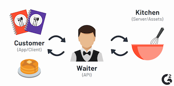
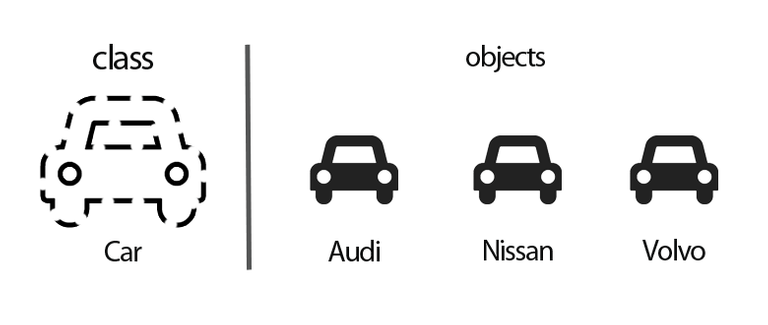

# General Web Development Interview Questions

Q. What is A/B testing?

Answer

A/B testing (also known as split testing) is a process of showing two variants of the same web page or app to different segments of visitors or users at the same time and comparing which variant drives more conversions.

---

Q. What is AJAX?

Answer

Asynchronous JavaScript and XML (AJAX or Ajax) is a set of web development techniques using many web technologies on the client-side to create asynchronous web applications.

With Ajax, web applications can send and retrieve data from a server asynchronously (in the background) without interfering with the display and behavior of the existing page.

---

Q. What is an API?

Answer

An application programming interface (API) is a set of clearly defined methods of communication among various components.

An API simplifies programming by abstracting the underlying implementation and only exposing objects or actions the developer needs.

---

Q. How does Continuous Integration (CI) differ from Continuous Delivery (CD)?

Answer

**Continuous Integration** is merging all code from all developers to one central branch of the repo many times a day trying to avoid conflicts in the code in the future.

**Continuous Deployment** ensures that every change that is made is ready to be deployed to production.

CI helps development teams avoid "integration hell" where the software works on individual developers' machines, but it fails when all developers combine (or "integrate") their code. Continuous Delivery goes one step further to automate a software release, which typically involves packaging the software for deployment in a production-like environment. The goal of Continuous Delivery is to make sure the software is always ready to go to production, even if the team decides not to do it for business reasons.

---

Q. What is Object-oriented programming (OOP)?

Answer

Object-oriented programming (OOP) is a programming paradigm that relies on the concept of classes and objects. A class is a template (blueprint) for objects, and an object is an instance of a class.

---

Q. Are you familiar with the four pillars of object-oriented programming?

Answer

The four principles (pillars) of object-oriented programming are abstraction, encapsulation, inheritance, and polymorphism.

**Abstraction**: hiding the inner workings of a class and just allowing the necessary portions be visible.

**Encapsulation**: a process of binding data members (variables, properties) and member functions (methods) together. In object oriented programming language we achieve encapsulation through Class.

**Inheritance**: the process of creating the new class by extending the the existing class

**Polymorphism**: functions with same name but different arguments, which will perform differently. That is function with same name, functioning in different way. Or, it also allows us to redefine a function to provide its new definition.

---
